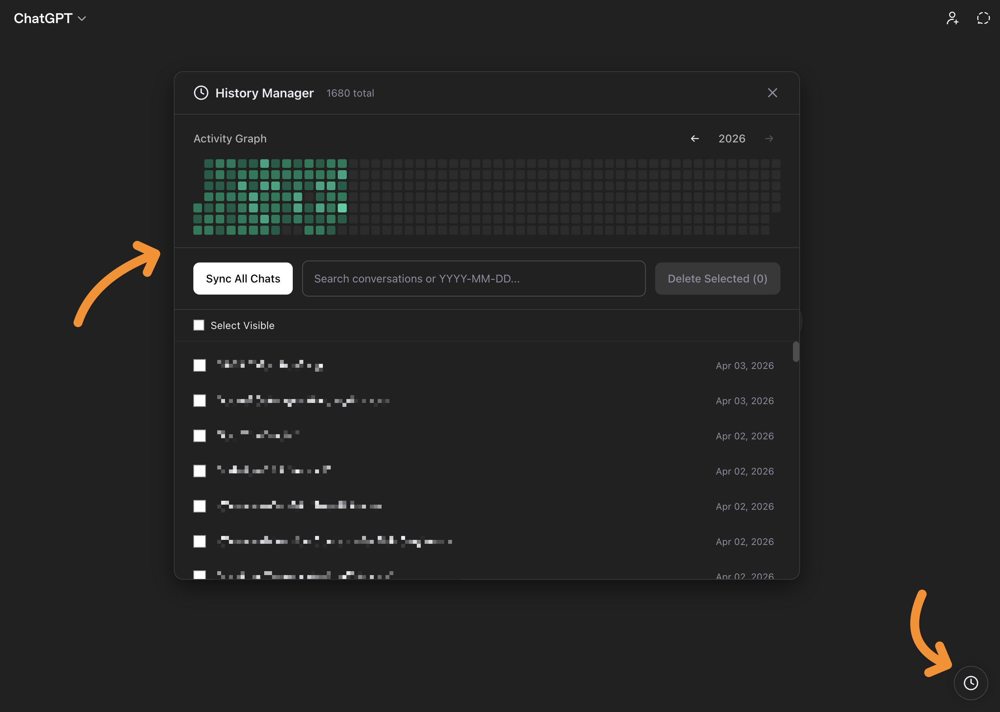

# ChatGPT History Manager

A minimal browser extension that adds a **History Manager** panel to [ChatGPT](https://chatgpt.com) so you can **sync**, **search**, and **bulk-delete** conversations from one place.

## Features

- **Sync all chats** — Pulls your full conversation list via ChatGPT’s authenticated APIs (paginated, with gentle rate limiting) and caches it in the browser.
- **Search** — Filter by title or by date using `YYYY-MM-DD`. Multiple space-separated terms act as AND filters.
- **Activity graph** — Yearly heatmap of chat activity; hover for counts, click a day to jump the search to that date.
- **Bulk selection** — Check individual rows or use **Select Visible** to target everything that matches the current search.
- **Bulk delete** — Removes selected conversations (same soft-hide behavior ChatGPT uses when you delete a chat).
- **Native-feeling UI** — Floating action button, draggable header, resizable panel, keyboard-friendly list with links that open chats in-app.

## Requirements

- [Google Chrome](https://www.google.com/chrome/) or another **Chromium** browser (Brave, Arc, etc.) with Manifest V3 support.
- An active **ChatGPT** session at `https://chatgpt.com` (you must be logged in).

## Installation (load unpacked)

1. Clone or download this repository.
2. Open `chrome://extensions` (or `edge://extensions`).
3. Enable **Developer mode**.
4. Click **Load unpacked** and choose the folder that contains `manifest.json`.

The extension only runs on `https://chatgpt.com/*`.

## Usage

1. Go to [chatgpt.com](https://chatgpt.com) and sign in.
2. Click the **clock** button in the bottom-right corner to open **History Manager**.
3. Click **Sync All Chats** to fetch or refresh the list (first open may sync automatically if the cache is empty).
4. Use the search box, heatmap, and checkboxes as needed; **Delete Selected** asks for confirmation before removing chats.

Cached data is stored in `localStorage` under the key `cgm_chats` in the ChatGPT origin.

## How it works

The content script:

- Reads your session token from `/api/auth/session`.
- Lists conversations with `GET /backend-api/conversations?offset=…&limit=…&order=updated`.
- Hides selected conversations with `PATCH /backend-api/conversation/{id}` and `{ "is_visible": false }`.

ChatGPT’s web app and APIs can change at any time; this project is **not** affiliated with or endorsed by OpenAI.

## Privacy

- The extension runs **only** on `chatgpt.com` pages you open.
- Conversation metadata is kept **locally** in your browser until you clear site data or remove the extension.
- Network calls use your **existing** logged-in session—the extension does not send data to third-party servers.

## Contributing

Issues and pull requests are welcome. If you add a feature, try to keep the footprint small (this repo is intentionally a single content script plus manifest).

## License

[MIT](LICENSE) © Aykut Kardas
